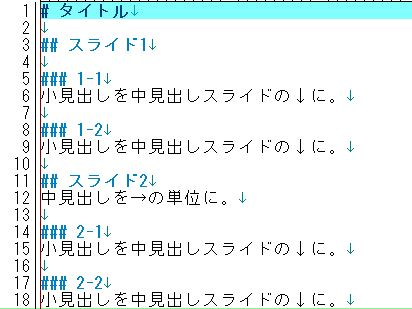

# タイトル

---

## スライド1
- スライド1コンテンツ
- スライド1コンテンツ
- スライド1コンテンツ

+++

### 1-1
小見出しを中見出しスライドの↓に。

+++

### 1-2
小見出しを中見出しスライドの↓に。

---

## スライド2
中見出しを→の単位に。

画像はどのように見せようか。

+++

### 2-1
小見出しを中見出しスライドの↓に。

+++

### 2-2
小見出しを中見出しスライドの↓に。
